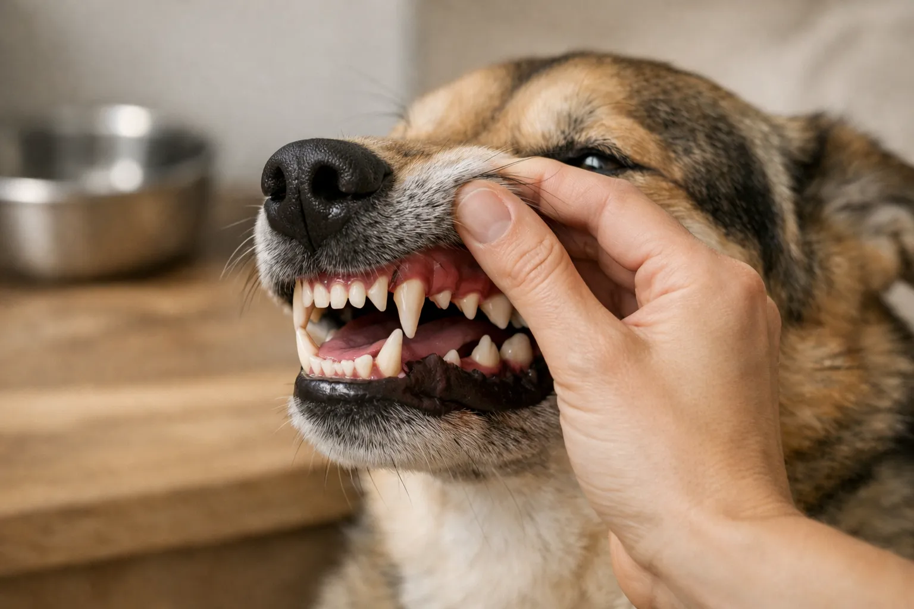
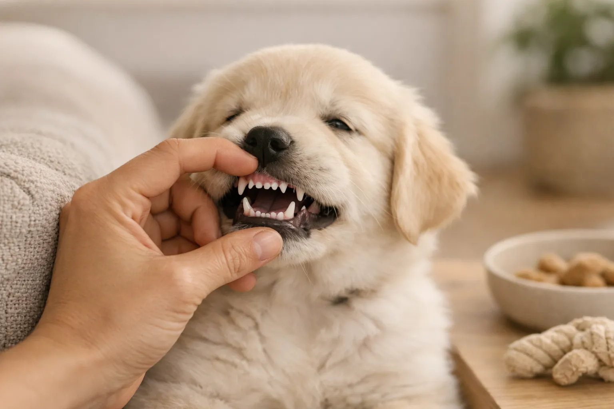

Ein erwachsener Hund hat 42 Zähne -- 20 im Oberkiefer und 22 im Unterkiefer. Damit besitzt ein Hund 10 Zähne mehr als der Mensch. Das Hundegebiss ist ein hochspezialisiertes Werkzeug, das zum Greifen, Reißen, Kauen und sogar zur Fellpflege dient.

Ob Welpe mit 28 Milchzähnen oder ausgewachsener Hund mit vollständigem Gebiss -- wie viele Zähne ein Hund hat, hängt vom Alter ab. In diesem Ratgeber erfährst du alles über die verschiedenen Zahnarten, den Ablauf des Zahnwechsels, typische Zahnprobleme und die richtige Zahnpflege für deinen Hund.

Zusammenfassung: Wie viele Zähne hat ein Hund?

<ul>
<li><strong>42 Zähne beim erwachsenen Hund</strong> -- 12 Schneidezähne, 4 Fangzähne, 16 Prämolaren, 10 Molaren</li>
<li><strong>28 Milchzähne beim Welpen</strong> -- Milchgebiss ohne Molaren, vollständig ab der 6. Lebenswoche</li>
<li><strong>Zahnwechsel zwischen Monat 3 und 7</strong> -- Schneidezähne fallen zuerst aus, Fangzähne zuletzt</li>
<li><strong>80 % aller Hunde über 3 Jahre</strong> haben laut Studien Zahnerkrankungen</li>
<li><strong>Tägliches Zähneputzen empfohlen</strong> -- mindestens 3-mal pro Woche mit Hundezahnpasta</li>
</ul>

42

Zähne beim erwachsenen Hund

28

Milchzähne beim Welpen

3.–7.

Monat: Zahnwechsel

80 %

haben Zahnprobleme (ab 3 J.)

## Wie viele Zähne hat ein erwachsener Hund?

Ein ausgewachsener Hund hat genau 42 bleibende Zähne. Diese Anzahl ist bei allen Hunderassen identisch -- vom Chihuahua bis zur Deutschen Dogge. Der Oberkiefer enthält 20 Zähne, der Unterkiefer 22 Zähne. Der Unterschied entsteht durch zwei zusätzliche Molaren im Unterkiefer.

Die 42 Zähne des Hundegebisses verteilen sich auf vier verschiedene Zahntypen, die jeweils eine spezifische Funktion erfüllen. Jeder Zahntyp sitzt an einer bestimmten Position im Kiefer und ist in Form und Größe an seine Aufgabe angepasst.

### Die 4 Zahnarten im Hundegebiss

Das Hundegebiss besteht aus Schneidezähnen (Incisivi), Fangzähnen (Canini), Prämolaren (vordere Backenzähne) und Molaren (hintere Backenzähne). Die Zahnformel des Hundes lautet im Oberkiefer: 3-1-4-2 und im Unterkiefer: 3-1-4-3 -- jeweils pro Kieferhälfte.

| Zahnart | Fachbegriff | Oberkiefer | Unterkiefer | Gesamt | Funktion |
|---|---|---|---|---|---|
| Schneidezähne | Incisivi | 6 | 6 | 12 | Abknabbern, Fellpflege |
| Fangzähne | Canini | 2 | 2 | 4 | Greifen, Festhalten |
| Prämolaren | Prämolaren | 8 | 8 | 16 | Zerkleinern, Zerreißen |
| Molaren | Molaren | 4 | 6 | 10 | Zermahlen, Zerquetschen |
| **Gesamt** | | **20** | **22** | **42** | |

🦷

12 Schneidezähne

Die kleinen Zähne vorne im Kiefer dienen zum Abknabbern von Fleisch vom Knochen und zur Fellpflege.

🐺

4 Fangzähne

Die langen, spitzen Eckzähne greifen und halten Beute fest. Sie sind die kräftigsten Zähne im Hundegebiss.

🦴

16 Prämolaren

Die vorderen Backenzähne zerreißen und zerkleinern Nahrung. Der größte Prämolar heißt Reißzahn (P4).

🥩

10 Molaren

Die hinteren Backenzähne zermahlen pflanzliche Nahrung und Knochen. Im Unterkiefer sitzen 6, im Oberkiefer 4.

### Der Reißzahn -- der wichtigste Zahn im Hundegebiss

Der Reißzahn (Dens sectorius) ist der größte Prämolar im Oberkiefer (P4) und der erste Molar im Unterkiefer (M1). Diese beiden Zähne arbeiten wie eine Schere zusammen und sind für das Zerteilen von Fleisch und Sehnen zuständig. Der Reißzahn ist ein Überbleibsel aus der Evolution des Hundes als Beutegreifer.

Tierärzte achten bei Zahnkontrollen besonders auf die Reißzähne, da sie aufgrund ihrer Größe und Belastung anfällig für Frakturen sind. Harte Kauartikel wie Geweihstangen oder Markknochen können den Reißzahn beschädigen.

ℹ️

<strong>Vergleich: Hund vs. Mensch</strong>

Der Mensch hat 32 Zähne, der Hund 42. Der Unterschied liegt vor allem bei den Prämolaren und Molaren: Hunde haben mehr Backenzähne, die auf das Zerreißen und Zerkleinern von Fleisch spezialisiert sind. Außerdem besitzen Hunde ausgeprägte Fangzähne, die beim Menschen nur rudimentär vorhanden sind.

## Wie viele Milchzähne hat ein Welpe?

Ein Welpe hat 28 Milchzähne. Das Milchgebiss ist kleiner als das bleibende Gebiss, weil die Molaren (hintere Backenzähne) komplett fehlen. Im Milchgebiss befinden sich 12 Schneidezähne, 4 Fangzähne und 12 Prämolaren.

Die Milchzähne sind deutlich kleiner, spitzer und weißer als die bleibenden Zähne. Sie brechen ab der 3. Lebenswoche durch und sind bis zur 6. Lebenswoche vollständig sichtbar. Welpen nutzen ihre nadelspitzen Milchzähne zum Erkunden der Umgebung, zum Spielen und zum Erlernen der Beißhemmung.

| Zahnart | Oberkiefer | Unterkiefer | Gesamt |
|---|---|---|---|
| Schneidezähne | 6 | 6 | 12 |
| Fangzähne | 2 | 2 | 4 |
| Prämolaren | 6 | 6 | 12 |
| Molaren | 0 | 0 | 0 |
| **Gesamt** | **14** | **14** | **28** |

### Wann brechen die Milchzähne durch?

Die Milchzähne eines Welpen brechen in einer festen Reihenfolge durch. Zuerst erscheinen die Fangzähne, dann die Schneidezähne und zuletzt die Prämolaren. Der gesamte Durchbruch dauert etwa 3 Wochen.

| Zahnart | Durchbruch (Alter) |
|---|---|
| Fangzähne | 3.–4. Lebenswoche |
| Schneidezähne | 4.–5. Lebenswoche |
| Prämolaren | 5.–6. Lebenswoche |

💡

<strong>Tipp für Welpenbesitzer</strong>

Die nadelspitzen Milchzähne können beim Spielen schmerzhaft sein. Biete deinem Welpen geeignete Kauspielzeuge an, um sein Kaubedürfnis zu stillen und gleichzeitig die Beißhemmung zu trainieren. Gekühlte Kauartikel können zusätzlich das Zahnfleisch beruhigen.

## Zahnwechsel beim Hund: Ablauf und Zeitplan

Der Zahnwechsel beim Hund beginnt zwischen dem 3. und 4. Lebensmonat und ist in der Regel bis zum 7. Lebensmonat abgeschlossen. Während dieser Phase fallen die 28 Milchzähne aus und werden durch 42 bleibende Zähne ersetzt. Gleichzeitig wachsen die 10 Molaren nach, die im Milchgebiss nicht vorhanden waren.

Der Zahnwechsel verläuft in einer bestimmten Reihenfolge. Die Schneidezähne fallen zuerst aus, gefolgt von den Prämolaren und zuletzt den Fangzähnen. Bei kleinen Hunderassen kann der Zahnwechsel etwas später beginnen und länger dauern als bei großen Rassen.

1

Schneidezähne (Monat 3–5)

Die 12 Milch-Schneidezähne fallen zuerst aus und werden durch bleibende Schneidezähne ersetzt.

2

Prämolaren (Monat 4–6)

Die 12 Milch-Prämolaren werden durch 16 bleibende Prämolaren ersetzt -- 4 zusätzliche Prämolaren wachsen nach.

3

Fangzähne (Monat 5–7)

Die 4 Milch-Fangzähne fallen als Letztes aus. Die bleibenden Fangzähne sind deutlich größer und kräftiger.

✓

Molaren wachsen nach (Monat 4–7)

Die 10 Molaren haben keine Milchzahn-Vorgänger und wachsen parallel zum Zahnwechsel direkt als bleibende Zähne.

### Symptome des Zahnwechsels erkennen

Der Zahnwechsel ist für Welpen oft unangenehm. Typische Anzeichen sind vermehrtes Kauen auf Gegenständen, leichtes Zahnfleischbluten, Appetitlosigkeit und Unruhe. Manche Welpen sabbern stärker als gewöhnlich oder verweigern hartes Futter vorübergehend.

Leichtes Zahnfleischbluten während des Zahnwechsels ist normal und kein Grund zur Sorge. Wenn dein [Hund nicht frisst](https://hundewissen-mit-kopf.de/hundegesundheit/hund-frisst-nicht/) oder starke Schmerzen zeigt, solltest du allerdings den Tierarzt aufsuchen. In den meisten Fällen verläuft der Zahnwechsel ohne Komplikationen.

⚠️

<strong>Achtung bei Durchfall und Fieber</strong>

Leichte Verdauungsprobleme können während des Zahnwechsels auftreten, da Welpen verschluckte Milchzähne verdauen. Fieber über 39,5 °C, anhaltender Durchfall oder starke Appetitlosigkeit über mehr als 2 Tage sind jedoch keine normalen Zahnwechsel-Symptome und erfordern einen Tierarztbesuch.

### So unterstützt du deinen Welpen beim Zahnwechsel

Während des Zahnwechsels hat dein Welpe ein starkes Kaubedürfnis. Geeignete Kauspielzeuge aus Naturkautschuk oder gefrorene Karotten lindern den Juckreiz im Zahnfleisch. Weiche das Trockenfutter bei Bedarf in warmem Wasser ein, um das Kauen zu erleichtern.

Kontrolliere das Gebiss deines Welpen regelmäßig -- etwa 1-mal pro Woche. Achte darauf, ob Milchzähne neben den bereits durchgebrochenen bleibenden Zähnen stehen bleiben. Diese sogenannten persistierenden Milchzähne müssen vom Tierarzt entfernt werden.

## Persistierende Milchzähne: Wenn der Zahnwechsel nicht klappt

Persistierende Milchzähne sind Milchzähne, die nicht rechtzeitig ausfallen, obwohl der bleibende Zahn bereits durchgebrochen ist. Dieses Problem betrifft laut tierärztlichen Studien etwa 5-7 % aller Hunde. Besonders häufig sind kleine Hunderassen wie Yorkshire Terrier, Chihuahua, Malteser und Zwergpudel betroffen.

Bleiben Milchzähne stehen, führt das oft zu einer Doppelreihe von Zähnen. Die bleibenden Zähne werden in eine Fehlstellung gedrängt, und zwischen den eng stehenden Zähnen sammeln sich Futterreste und Bakterien. Ohne Behandlung können Zahnstein, Zahnfleischentzündungen und Parodontitis die Folge sein.

🚫

<strong>Persistierende Milchzähne immer vom Tierarzt entfernen lassen</strong>

Versuche niemals, einen Milchzahn selbst zu ziehen oder zu lockern. Die Wurzeln der Milchzähne sind lang und dünn -- sie können beim Ziehen abbrechen und Infektionen verursachen. Der Tierarzt entfernt persistierende Milchzähne unter Narkose, häufig im Rahmen der Kastration.

## Zu viele Zähne beim Hund: Hyperdontie und Polyodontie

Manche Hunde haben mehr als die normalen 42 Zähne. Tierärzte bezeichnen überzählige Zähne als Hyperdontie oder Polyodontie. Diese Zahnfehlstellung tritt vor allem bei brachyzephalen (kurzköpfigen) Rassen wie Mops, Französischer Bulldogge und Boxer auf, da ihr verkürzter Kiefer weniger Platz für die reguläre Zahnanzahl bietet.

Überzählige Zähne verursachen Platzmangel im Kiefer, was zu Fehlstellungen, Zahnfleischentzündungen und beschleunigter Zahnsteinbildung führt. Der Tierarzt kann überzählige Zähne im Rahmen einer Zahnkontrolle identifizieren und bei Bedarf entfernen. Eine jährliche Zahnkontrolle ist bei prädisponierten Rassen besonders wichtig.

📖

Definition: Hyperdontie (Polyodontie)

Hyperdontie bezeichnet das Vorhandensein überzähliger Zähne über die normale Zahnanzahl hinaus. Beim Hund bedeutet das mehr als 42 bleibende Zähne oder mehr als 28 Milchzähne. Die Ursache ist meist genetisch bedingt.

## Häufige Zahnprobleme beim Hund

Rund 80 % aller Hunde über 3 Jahre leiden laut dem American Veterinary Dental College an einer Form von Zahnerkrankung. Zahnprobleme gehören damit zu den häufigsten Gesundheitsproblemen bei Hunden überhaupt. Frühzeitig erkannt, lassen sich die meisten Zahnerkrankungen gut behandeln.

### Zahnstein beim Hund

Zahnstein entsteht, wenn sich Zahnbelag (Plaque) mit Mineralien aus dem Speichel verbindet und verhärtet. Dieser Prozess dauert etwa 3-5 Tage. Zahnstein ist als gelblich-braune Ablagerung an der Zahnoberfläche sichtbar, besonders an den Außenseiten der Oberkiefer-Backenzähne.

Ohne Behandlung breitet sich Zahnstein unter das Zahnfleisch aus und verursacht Zahnfleischentzündungen (Gingivitis). Eine professionelle Zahnreinigung beim Tierarzt unter Narkose entfernt den Zahnstein vollständig. Die Kosten liegen je nach Schweregrad zwischen 100 und 400 Euro.

### Parodontitis (Zahnfleischentzündung)

Parodontitis ist die häufigste Zahnerkrankung beim Hund. Sie entsteht durch Bakterien, die sich im Zahnfleischtaschenbereich ansiedeln und das Zahnhaltegewebe zerstören. Unbehandelt führt Parodontitis zu Zahnlockerung, Zahnverlust und kann sogar Organe wie Herz, Leber und Nieren schädigen.

Typische Symptome sind gerötetes Zahnfleisch, Mundgeruch, Zahnfleischbluten und Schwierigkeiten beim Kauen. Kleine Hunderassen sind aufgrund ihrer engstehenden Zähne häufiger betroffen als große Rassen.

### Abgebrochene Zähne

Zahnfrakturen gehören zu den häufigsten Zahnverletzungen bei Hunden. Ursachen sind harte Kauartikel wie Geweihstangen, Steine, Markknochen oder Unfälle. Am häufigsten brechen die Fangzähne und der Reißzahn (P4 im Oberkiefer).

Ein abgebrochener Zahn mit freiliegendem Zahnmark (Pulpa) ist schmerzhaft und kann sich infizieren. Tierärzte behandeln Zahnfrakturen je nach Schweregrad mit einer Wurzelkanalbehandlung oder Zahnextraktion. Bei einem sichtbar abgebrochenen Zahn solltest du innerhalb von 48 Stunden den Tierarzt aufsuchen.

Sichere Kauartikel

<ul>
<li>Kauartikel aus getrockneter Rinderhaut</li>
<li>Kauwurzeln aus Kaffeeholz oder Olivenholz</li>
<li>Naturkautschuk-Spielzeuge (z. B. Kong)</li>
<li>Getrocknete Rinderohren oder Rinderkopfhaut</li>
</ul>

Riskante Kauartikel

<ul>
<li>Geweihstangen (extrem hart, Frakturgefahr)</li>
<li>Markknochen (können splittern)</li>
<li>Steine (Zahnabrieb und Frakturen)</li>
<li>Tennisbälle (Filz schleift Zahnschmelz ab)</li>
</ul>

## Zahnpflege beim Hund: So bleiben die 42 Zähne gesund

Regelmäßige Zahnpflege ist der wichtigste Faktor für ein gesundes Hundegebiss. Tierärzte empfehlen, die Zähne des Hundes täglich zu putzen -- mindestens jedoch 3-mal pro Woche. Studien zeigen, dass tägliches Zähneputzen die Zahnsteinbildung um bis zu 70 % reduzieren kann.

### Zähneputzen beim Hund -- Schritt für Schritt

Das Zähneputzen sollte bereits im Welpenalter trainiert werden. Verwende ausschließlich Hundezahnpasta -- menschliche Zahnpasta enthält Fluorid und oft Xylit, die für Hunde [giftig](https://hundewissen-mit-kopf.de/hundegesundheit/vergiftung-hund/) sein können. Hundezahnpasten gibt es in Geschmacksrichtungen wie Geflügel oder Rind, die das Putzen erleichtern.

1

Gewöhnung

Lass deinen Hund die Zahnpasta von deinem Finger lecken. Massiere sanft das Zahnfleisch mit dem Finger.

2

Fingerbürste einführen

Nutze eine Fingerbürste oder Fingerling mit Zahnpasta. Putze zunächst nur die vorderen Zähne in kreisenden Bewegungen.

3

Alle Zähne putzen

Arbeite dich langsam zu den Backenzähnen vor. Konzentriere dich auf die Außenseiten -- dort bildet sich am meisten Zahnstein.

✓

Belohnen

Lobe deinen Hund nach jeder Zahnpflege-Sitzung ausgiebig. So verknüpft er das Zähneputzen mit etwas Positivem.

### Ergänzende Zahnpflegemaßnahmen

Neben dem Zähneputzen gibt es weitere Maßnahmen, die zur Zahngesundheit deines Hundes beitragen. Diese ersetzen das Putzen nicht, können es aber sinnvoll ergänzen.

| Maßnahme | Wirksamkeit | Häufigkeit | Hinweis |
|---|---|---|---|
| Zähneputzen | Sehr hoch | Täglich bis 3x/Woche | Goldstandard der Zahnpflege |
| Kauartikel (Rinderhaut, Kauwurzeln) | Mittel | Täglich | Mechanische Reinigung durch Kauen |
| Dental-Snacks (VOHC-zertifiziert) | Mittel | 1x täglich | Auf VOHC-Siegel achten |
| Trinkwasserzusätze | Gering bis mittel | Täglich | Ergänzung, kein Ersatz |
| Professionelle Zahnreinigung | Sehr hoch | 1x jährlich | Beim Tierarzt unter Narkose |

✅

<strong>VOHC-Siegel als Orientierung</strong>

Das Veterinary Oral Health Council (VOHC) prüft und zertifiziert Zahnpflegeprodukte für Haustiere. Produkte mit dem VOHC-Siegel haben in klinischen Studien nachweislich Zahnbelag oder Zahnstein reduziert. Achte beim Kauf von Dental-Snacks und Zahnpflegeprodukten auf dieses Siegel.

## Zahngesundheit nach Hunderasse und Größe

Die Zahngesundheit variiert je nach Hunderasse und Körpergröße erheblich. Kleine Hunderassen sind deutlich anfälliger für Zahnprobleme als große Rassen. Der Grund: Ihre Kiefer sind proportional kleiner, die Zähne stehen enger zusammen und Futterreste lagern sich leichter ab.

### Kleine Rassen (unter 10 kg)

Kleine Hunde wie Chihuahua, Yorkshire Terrier und Malteser haben das höchste Risiko für Zahnerkrankungen. Laut veterinärmedizinischen Studien entwickeln bis zu 85 % der kleinen Hunde vor dem 4. Lebensjahr Zahnstein. Persistierende Milchzähne und Zahnfehlstellungen treten bei kleinen Rassen 5-mal häufiger auf als bei großen Rassen. Für [Anfänger geeignete Hunderassen](https://hundewissen-mit-kopf.de/hunderassen/hunderasse-fuer-anfaenger/) im kleinen Format benötigen daher besonders konsequente Zahnpflege.

### Brachyzephale Rassen

Kurzköpfige Rassen wie Mops, Französische Bulldogge und Boxer haben aufgrund ihres verkürzten Kiefers häufig Zahnfehlstellungen und überzählige Zähne. Die Zähne stehen oft gedreht oder schief, was die Reinigung erschwert und Zahnstein begünstigt. Jährliche tierärztliche Zahnkontrollen sind bei diesen Rassen besonders wichtig.

### Große Rassen (über 25 kg)

Große Hunderassen haben seltener Zahnstein, sind aber anfälliger für Zahnfrakturen. Ihre kräftigeren Kiefer erzeugen höhere Beißkräfte, was bei harten Kauartikeln zu Zahnbrüchen führen kann. Die Beißkraft eines großen Hundes kann über 300 Newton betragen.

## Wann zum Tierarzt? Warnsignale für Zahnprobleme

Zahnprobleme beim Hund entwickeln sich oft schleichend. Hunde zeigen Schmerzen im Maul erst spät, da sie evolutionär darauf programmiert sind, Schwäche zu verbergen. Regelmäßige Kontrollen -- mindestens 1-mal jährlich beim Tierarzt und wöchentlich zu Hause -- sind daher entscheidend.

✅ Warnsignale: Wann zum Tierarzt?

Starker Mundgeruch (über das normale Maß hinaus)

Gerötetes, geschwollenes oder blutendes Zahnfleisch

Sichtbarer Zahnstein (gelblich-braune Ablagerungen)

Einseitiges Kauen oder Futterverweigerung

Lockere oder abgebrochene Zähne

Vermehrtes Speicheln oder blutiger Speichel

Schwellung im Gesichtsbereich (Hinweis auf Zahnwurzelabszess)

Hund lässt sich nicht am Maul berühren

Wenn dein [Hund zittert](https://hundewissen-mit-kopf.de/hundegesundheit/hund-zittert-ursachen-tun-kannst/) oder apathisch wirkt und gleichzeitig Zahnprobleme zeigt, kann eine Zahninfektion die Ursache sein. Zahnwurzelabszesse können Fieber und starke Schmerzen verursachen und erfordern eine sofortige tierärztliche Behandlung.

## Ernährung und Zahngesundheit beim Hund

Die Ernährung beeinflusst die Zahngesundheit deines Hundes erheblich. Trockenfutter hat einen leichten mechanischen Reinigungseffekt durch das Kauen der Kroketten, ersetzt aber keinesfalls das Zähneputzen. Nassfutter und weiches Futter bleiben stärker an den Zähnen haften und begünstigen Zahnbelag.

Zuckerhaltige Leckerlis und stärkereiches Futter fördern die Vermehrung von Bakterien im Maul. [Obst wie Äpfel](https://hundewissen-mit-kopf.de/hundeernaehrung/duerfen-hunde-aepfel-essen/) in kleinen Stücken kann als natürlicher Snack dienen, der durch seine Faserstruktur einen leichten Reinigungseffekt hat. Rohes Gemüse wie Karotten eignet sich ebenfalls als zahnfreundlicher Kausnack.

💡

<strong>Zahnfreundliche Ernährungstipps</strong>

Biete deinem Hund regelmäßig rohe Karotten oder Apfelstücke als Snack an. Das Kauen fördert den Speichelfluss, der Bakterien neutralisiert. Vermeide zuckerhaltige Leckerlis und achte auf eine ausgewogene Ernährung mit ausreichend Kalzium für starke Zähne.

## Fazit: Wie viele Zähne hat ein Hund -- und wie bleiben sie gesund?

Ein erwachsener Hund hat 42 Zähne, ein Welpe 28 Milchzähne. Der Zahnwechsel findet zwischen dem 3. und 7. Lebensmonat statt und verläuft in den meisten Fällen problemlos. Die vier Zahnarten -- Schneidezähne, Fangzähne, Prämolaren und Molaren -- erfüllen jeweils spezifische Funktionen im Hundegebiss.

Da rund 80 % aller Hunde über 3 Jahre an Zahnerkrankungen leiden, ist konsequente Zahnpflege unverzichtbar. Tägliches Zähneputzen mit Hundezahnpasta, geeignete Kauartikel und jährliche tierärztliche Zahnkontrollen bilden die drei Säulen gesunder Hundezähne. Besonders bei kleinen und kurzköpfigen Rassen lohnt sich die regelmäßige Kontrolle des Gebisses -- je früher Zahnprobleme erkannt werden, desto einfacher und günstiger ist die Behandlung.